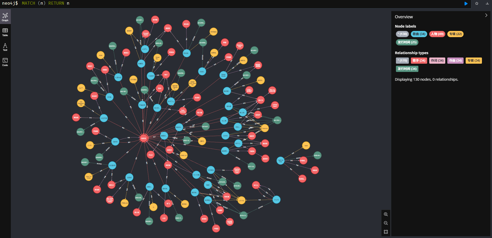
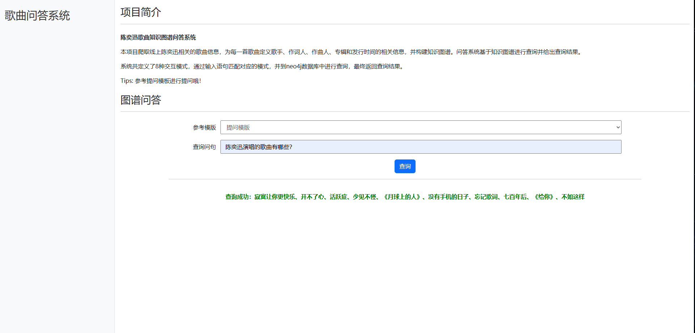
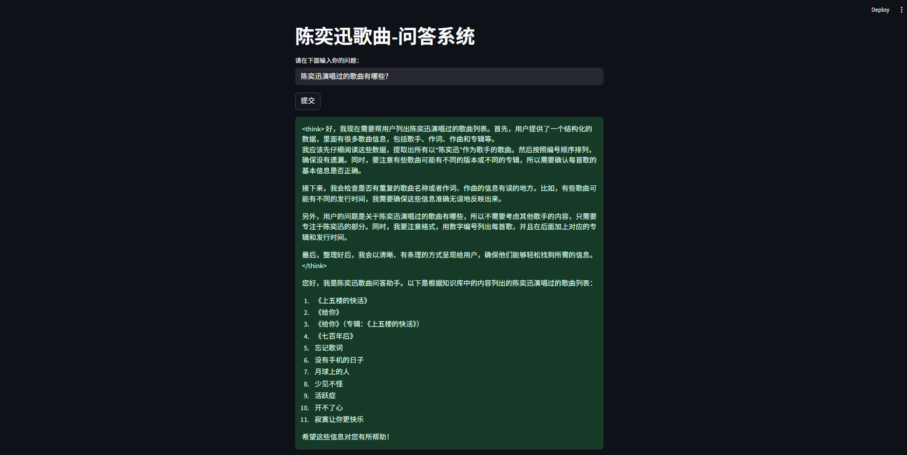

# 项目介绍 :tada:

- 本项目旨在构建陈奕迅歌曲知识图谱问答系统，回答陈奕迅歌曲的相关信息，比如歌曲的作词人、作曲人，歌曲的所属专辑及发行时间等。
- 项目通过爬取线上数据，清理并整理为三元组格式数据，使用neo4j图数据库构建知识图谱。通过两个子项目进行问答交互，子项目1使用Cypher语句进行查询，子项目2通过本地部署大模型进行交互和查询。
- 最终构建的知识图谱界面如下，包含130个节点（4个种类，分别为歌曲、人物、专辑和发行时间）、170个关系（5个种类，分别为歌手、作词、作曲、专辑和发行时间）。

# 子项目介绍 :green_book:
## 子项目1：基于Cypher语句
- 技术选型：前端使用Vue框架、bootstrap和axios，后端使用flask框架，数据库使用neo4j。
- 项目定义了8种交互模式，通过输入语句匹配对应的模式，并到neo4j数据库中进行查询。8种模式如下：
  ``'歌曲(.+)所属的专辑是',
  '歌曲(.+)的歌手是',
  '歌曲(.+)的作词人是',
  '歌曲(.+)的作曲人是',
  '专辑(.+)包含的歌曲有',
  '(.+)演唱的歌曲有',
  '(.+)作词的歌曲有',
  '(.+)作曲的歌曲有',``
- 交互界面展示如下：

## 子项目2：基于ollama本地部署
*Tips：本项目首先要安装ollama,并下载大模型到本地。本项目使用的本地模式是``deepseek-r1:7b``。*

- 技术选型：前端使用streamlit框架，结合ollama的本地模型，通过设置prompt进行交互问答。
- 提示词设置如下：“基于以下结构化数据，建立知识关联以回答问题：每条记录以编号、歌曲名称、关系（如歌手、作词、作曲、专辑、发行时间）和其他信息（如人物、专辑名、时间）表示。每首歌可能有不同的关联信息，如歌手、作词人、作曲人，且这些信息可能重复或多次出现。通过结构化信息，能够识别某歌曲的某角色，如“0,是但求其爱,歌手,陈奕迅”说明 《是但求其爱》的歌手是陈奕迅。你的结构化知识库是{data}。用户的问题是{info}，你需要根据知识库中的内容回答用户的问题。每次回答之前说一句：您好，我是陈奕迅歌曲问答助手。"在本项目中，{data}表示180条三元组信息。
- 交互界面展示如下：

# 项目不足之处 :sweat_smile:
针对歌曲知识图谱，存在多个歌手合唱一首歌曲、多个作曲人共同作曲同一首歌曲之类的情况，然而在构建三元组时并没有考虑这一情况。例如，“Fight As One”这首歌的歌手是“陈奕迅,蔡依林”，本项目将“陈奕迅,蔡依林”作为一个节点进行表示，这是该项目的不足之处，即未考虑人物之间的合作关系。项目可以进一步添加“人物-合作-人物”这一关系，使得知识图谱表达更加准确。

# 致谢 :grin:
参考项目如下：http://openkg.cn/resource-list/ ，感谢作者的开源贡献。